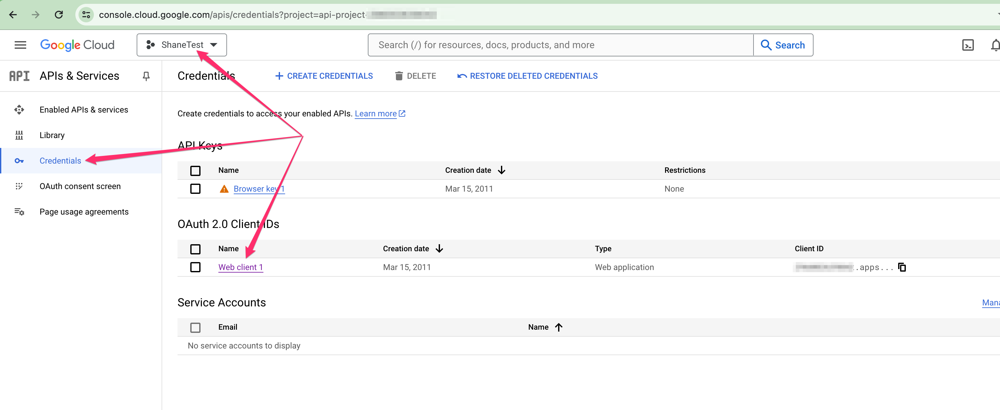
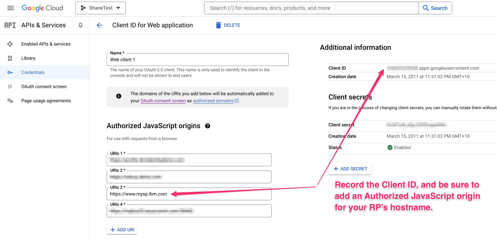

# FedCM Relying Party support for IBM Security Verify Access

This directory contains assets required to configure ISVA as a FedCM relying party.

## Use cases

The assets provided here at the time of writing permit configuration and testing of ISVA as a FedCM relying party, and have been tried with both Google as an IDP and also with another ISVA server as the IDP. With the chrome://flags/#fedcm-multi-idp flag set (as of Chrome 125), you can even test with both IDPs enabled at the same time.

The setup instructions here will focus on configuring ISVA as a FedCM RP for Google as the IDP, but it is very easy to add additional providers.

## ISVA Pre-requisites

The FedCM configuration requires ISVA to have both the AAC Authentication Service, and the Federation Security Token Service available. This means the advanced access control and federation modules must be activated.

## Pre-requisite Google APIs setup

Given that the instructions here will be for configuring FedCM RP with Google as the IDP, we first need to create a Google project and credentials to allow the ISVA system to act as a client. This can be done on the [Google APIs console](https://console.cloud.google.com/apis)

In my case I have a test project with OAuth 2.0 credentials. In the credential details, record the client ID value, and be sure to add an Authorized JavaScript origin for the web origin of your ISVA RP server:





## Update the mapping rule file with your IDP configuration

Take a look at the [FedCM.js](mappingrules/FedCM.js) mapping rule, in particular how the `_idpConfiguration` object is defined:
```
const _idpConfiguration = {
	/*
	"https://myidp.ibm.com": {
		clientID: "1e8697b0-2791-11ef-b4dd-bff0b72b7f0d",
		clientConfigURL: "https://myidp.ibm.com/fedcm/config.json",
		jwksEndpoint: "https://myidp.ibm.com/jwks"
	}
	,
	*/
	"https://accounts.google.com": {
		clientID: "YOUR_CLIENT.apps.googleusercontent.com",
		clientConfigURL: "https://accounts.google.com/gsi/fedcm.json",
		jwksEndpoint: "https://www.googleapis.com/oauth2/v3/certs"		
	}
};
```

You should notice that the demonstration ISVA IDP is commented out, and only the Google example remains. You will need to replace the `clientID` with the value from your Google APIs project.

## Upload page templates and mapping rule

The assets within the [templatepages](./templatepages/) and [mappingrules](./mappingrules/) directories should be loaded into ISVA. The template pages paths should be preserved as they are stored in this repository. The mapping rule can be loaded as an InfoMap type of rule.

## Create STS template and chain for validating JWT

The FedCM protocol results in the sharing of a `token` between the IDP and RP. The convention here is that this token is a JWT (although that's not actually part of the specification). Both the Google implemenation of FedCM as an IDP and that of the [ISVA IDP demonstration](../idp/README.md) provided in this repo both use JWT token types.

To validate the JWT token from the IDP, the [FedCM.js](mappingrules/FedCM.js) mapping rule uses the LocalSTSClient to call an STS chain for validation and issue a simple STSUU.

As such, you need to create an STS Chain Template (I called mine `stsuu_to_jwt`) with two modules:

| Token Type | Mode | 
|------------|------|
| Default Jwt Module | Validate |
| Default STSUU | Issue |
|------------|------|
 

You then create an STS Module Chain which instantiates this template, with the following lookup properties:

| Property | Value | 
|------------|------|
| Token Type | Validate (http://schemas.xmlsoap.org/ws/2005/02/trust/Validate) |
| AppliesTo Address | http://appliesto/stsuu |
| Issuer Address | http://issuer/jwt |
| Jwt Module | Checkbox for `Validate 'exp' is in the future` |
|------------|------|
