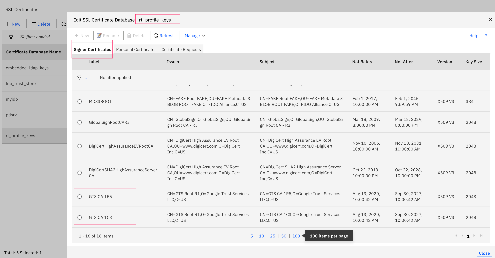
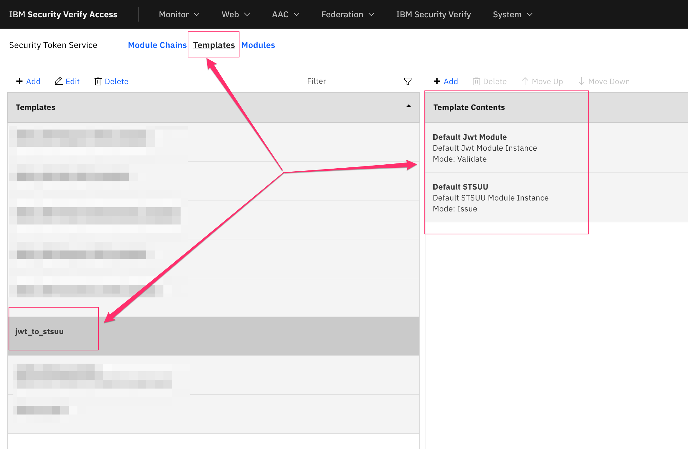
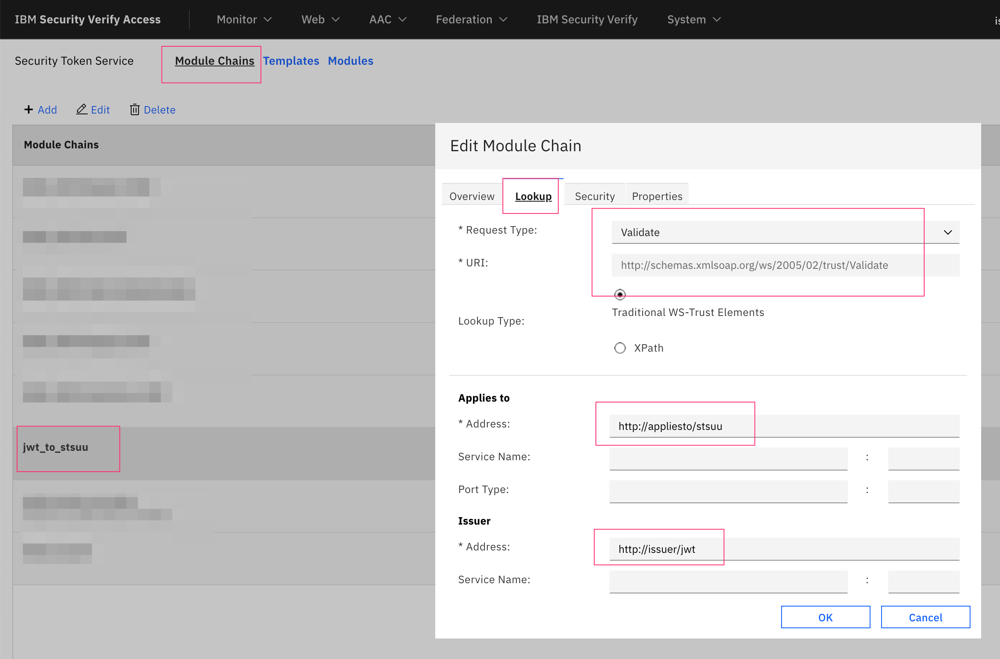
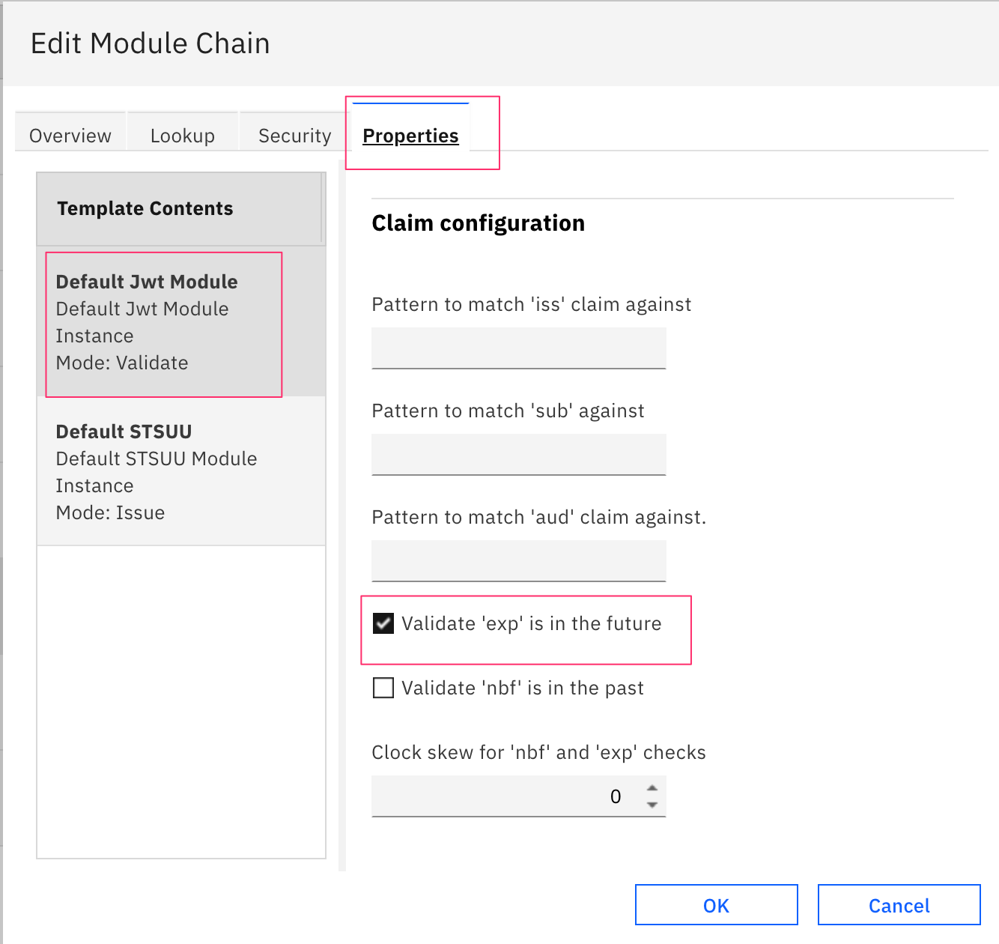
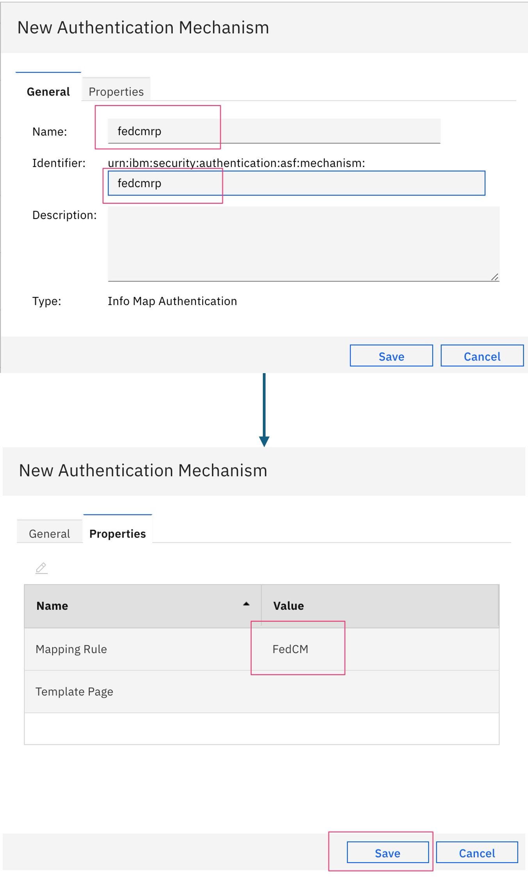
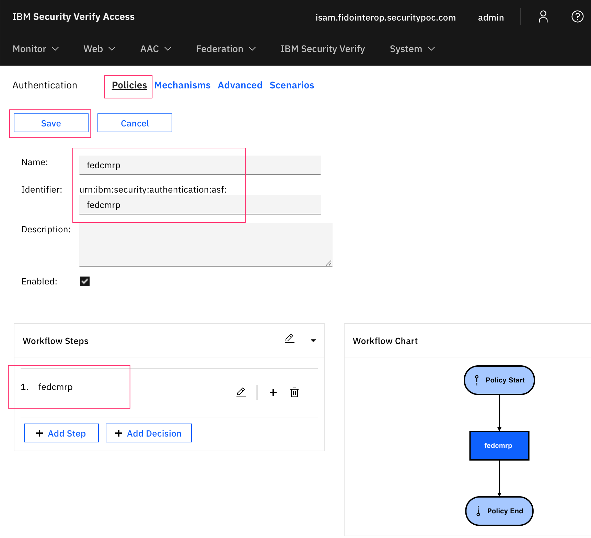
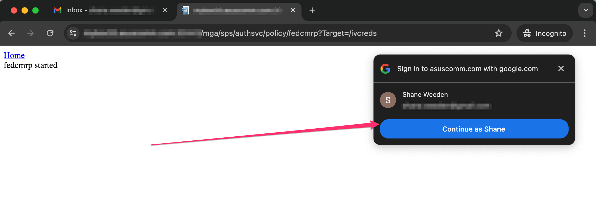
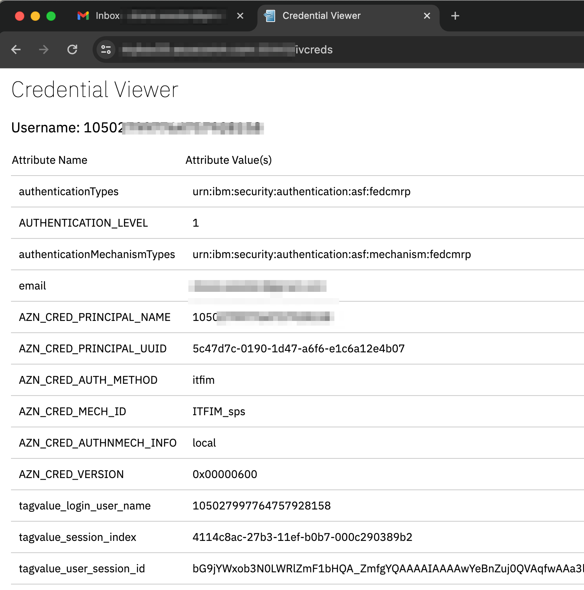

# FedCM Relying Party support for IBM Security Verify Access

This directory contains assets required to configure ISVA as a FedCM relying party.

## Use cases

The assets provided here at the time of writing permit configuration and testing of ISVA as a FedCM relying party, and have been tried with both Google as an IDP and also with another ISVA server as the IDP. With the chrome://flags/#fedcm-multi-idp flag set (as of Chrome 125), you can even test with both IDPs enabled at the same time.

The setup instructions here will focus on configuring ISVA as a FedCM RP for Google as the IDP, but it is very easy to add additional providers.

Note: At the time of writing, only the Chrome browser (I used version 125) supports FedCM.

Read more about the current status of the [Federated Credential Management API](https://developers.google.com/privacy-sandbox/3pcd/fedcm) on Google's website.

## ISVA Pre-requisites

The FedCM configuration requires ISVA to have both the AAC Authentication Service, and the Federation Security Token Service available. This means the advanced access control and federation modules must be activated.

The Web Reverse Proxy (WRP) should also have had the AAC Authentication service wizard run against it to ensure that EAI authentication is configured properly for the AAC authentication service.

## Pre-requisite Google APIs setup

Given that the instructions here will be for configuring FedCM RP with Google as the IDP, we first need to create a Google project and credentials to allow the ISVA system to act as a client. This can be done on the [Google APIs console](https://console.cloud.google.com/apis)

In my case I have a test project with OAuth 2.0 credentials. In the credential details, record the client ID value, and be sure to add an Authorized JavaScript origin for the web origin of your ISVA RP server:


## Update the mapping rule file with your IDP configuration

Take a look at the [FedCM.js](mappingrules/FedCM.js) mapping rule, in particular how the `_idpConfiguration` object is defined:
```
const _idpConfiguration = {
	/*
	"https://myidp.ibm.com": {
		clientID: "1e8697b0-2791-11ef-b4dd-bff0b72b7f0d",
		clientConfigURL: "https://myidp.ibm.com/fedcm/config.json",
		jwksEndpoint: "https://myidp.ibm.com/jwks"
	}
	,
	*/
	"https://accounts.google.com": {
		clientID: "YOUR_CLIENT.apps.googleusercontent.com",
		clientConfigURL: "https://accounts.google.com/gsi/fedcm.json",
		jwksEndpoint: "https://www.googleapis.com/oauth2/v3/certs"		
	}
};
```

You should notice that the demonstration ISVA IDP is commented out, and only the Google example remains. You will need to replace the `clientID` with the value from your Google APIs project. At least with Chrome 125, a special flag needs to be enabled if you wish to support more than one IDP (see chrome://flags/#fedcm-multi-idp). If only a single IDP is defined, no flag needs to be set.

The way this `_idpConfiguration` is constructed is that it is a JSON Object, with each key being the value of the `iss` claim of the JWT issued by that IDP provider, and the value of the key being a JSON Object with the three keys `clientID`, `clientConfigURL` and `jwksEndpoint` defined. 
 - The `clientID` comes from registration you perform at the IDP (see above for the Google example).
 - The `clientConfigURL` is the URL to a configuration document for FedCM. I discovered the Google value by first inspecting (and following redirects from) the web-identity well-known URL at `https://google.com/well-known/web-identity`.
 - The JWKS endpoint is something I discovered by simply searching for `Google JWKS endpoint`. Ultimately though, it needs to point to a JWKS that includes the public key of the signer of the JWT from the IDP.

## Load required trust certificates into the rt_profile_keys keystore

During the FedCM flow, the AAC runtime will try to access the `jwksEndpoint` URL defined for the IDP in the `_idpConfiguration` variable of the [FedCM.js](mappingrules/FedCM.js) mapping rule. If the runtime doesn't have the trusted TLS certificate chain for this endpoint, then JWT token validation will fail and the FedCM login will not complete. 

You can use a browser to visit the `jwksEndpoint` and retrieve the require CA and intermediate certificates, and make sure they are added as trusted certificates in the rt_profile_keys keystore that is used by the STS. These might change over time, but at the time of writing, for the Google IDP, these have been retrieved and are provided as shown:

 - [GTS Root R1.cer](google_tls_certs/GTS%20Root%20R1.cer)
 - [GTS CA 1C3.cer](google_tls_certs/GTS%20CA%201C3.cer)



## Upload page templates and mapping rule

The assets within the [templatepages](./templatepages/) and [mappingrules](./mappingrules/) directories should be loaded into ISVA. The template pages paths should be preserved as they are stored in this repository. The mapping rule can be loaded as an InfoMap type of rule.

## Create STS template and chain for validating JWT

The FedCM protocol results in the sharing of a `token` between the IDP and RP. The convention here is that this token is a JWT (although that's not actually part of the specification). Both the Google implemenation of FedCM as an IDP and that of the [ISVA IDP demonstration](../idp/README.md) provided in this repo both use JWT token types.

To validate the JWT token from the IDP, the [FedCM.js](mappingrules/FedCM.js) mapping rule uses the LocalSTSClient to call an STS chain for validation and issue a simple STSUU.

As such, you need to create an STS Chain Template (I called mine `stsuu_to_jwt`) with two modules:

| Token Type | Mode | 
|------------|------|
| Default Jwt Module | Validate |
| Default STSUU | Issue |

 

You then create an STS Module Chain which instantiates this template, with the following lookup properties:

| Property | Value | 
|------------|------|
| Token Type | Validate (http://schemas.xmlsoap.org/ws/2005/02/trust/Validate) |
| AppliesTo Address | http://appliesto/stsuu |
| Issuer Address | http://issuer/jwt |
| Jwt Module | Checkbox for `Validate 'exp' is in the future` |

If in any doubt, just make sure that the Lookup parameters for the module chain match how the chain is being called in the `doFedCMLogin` function of the [FedCM.js](mappingrules/FedCM.js) mapping rule.





## Create AAC Infomap Mechanism and Policy

Create a new AAC InfoMap authentication mechanism with mechanism URI `urn:ibm:security:authentication:asf:mechanism:fedcmrp` with the Mapping Rule set to the `FedCM` mapping rule:




Create a new AAC InfoMap authentication policy with mechanism URI `urn:ibm:security:authentication:asf:fedcmrp` with the previous Infomap Mechanism as the only workflow step:



## Ensure unauthenticated access is permitted to the policy

Ensure that the ACL / POP policy attached to the URL used to initialte this policy permits unauthenticated access:

```
pdadmin sec_master> object show /WebSEAL/localhost-default/mga/sps/authsvc/policy/fedcmrp
    Name: /WebSEAL/localhost-default/mga/sps/authsvc/policy/fedcmrp
        Description: Object from host mybox33.asuscomm.com.
        Type: 16 (Management Object) 
        Is Policy Attachable: Yes
        Extended Attributes: 
        Attached ACL: 
        Attached POP: level0pop
        Attached AuthzRule: 
         
        Effective Extended Attributes
          Protected Object Location: /WebSEAL/localhost-default/mga
          Name:     HTTP-Tag-Value
          Value(s): tagvalue_user_session_id=user_session_id
                    tagvalue_session_index=session_index
        Effective ACL: isam_mobile_unauth
        Effective POP: level0pop
        Effective AuthzRule: 
```

In my example above I have the ACL `isam_mobile_unauth` which permits unauthenticated access and the pop `level0pop` which has no conditions on authentication level (there are other POP attachments higher in my object namespace that place restrictions on other authsvc URLs which is why I use this POP).

## Recommended - enable the cred-viewer local application for credential debugging

In the WRP configuration file:

```
[local-apps]
cred-viewer=ivcreds
```


## Test the authenticaiton policy

First, ensure in your browser that you are already logged into the IDP account (such as accounts.google.com), otherwise FedCM will not work.

Using a browser, visit your RP policy URL with the `Target` set to the credential viewer local application, for example: 

```
https://www.mysp.ibm.com/mga/sps/authsvc/policy/fedcmrp?Target=/ivcreds
```

All being well, you should first see a prompt to sign in with your Google account. This is FedCM in action, being orchestrated by the browser. If you continue, login should complete and the credential viewer application will show various attributes of your assertion token.





## Troubleshooting

There are two main things to look at when troubleshooting the FedCM flow. The first is the browser console - use the browser debugging tools to access this. The other is the trace.log of the AAC / Federation runtime of the ISVA system. I recommend the trace string:

```
com.tivoli.am.fim.trustserver.sts.utilities.*=all:com.tivoli.am.fim.trustserver.sts.modules.*=all
```

